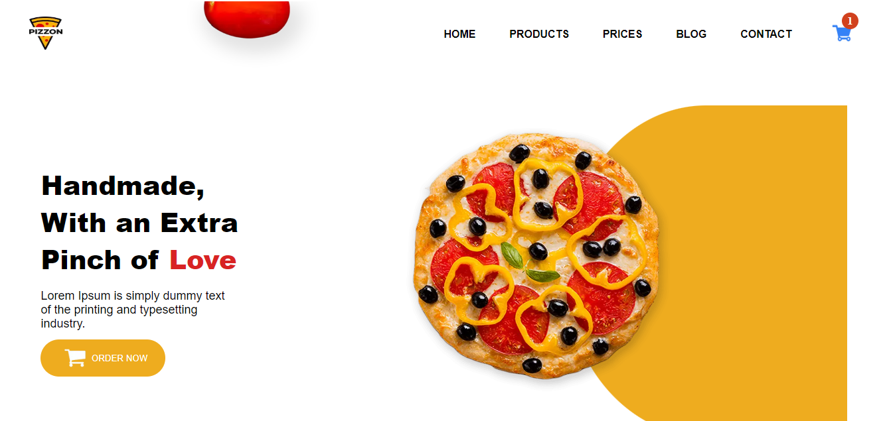
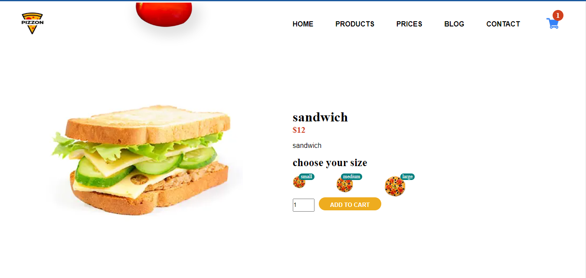
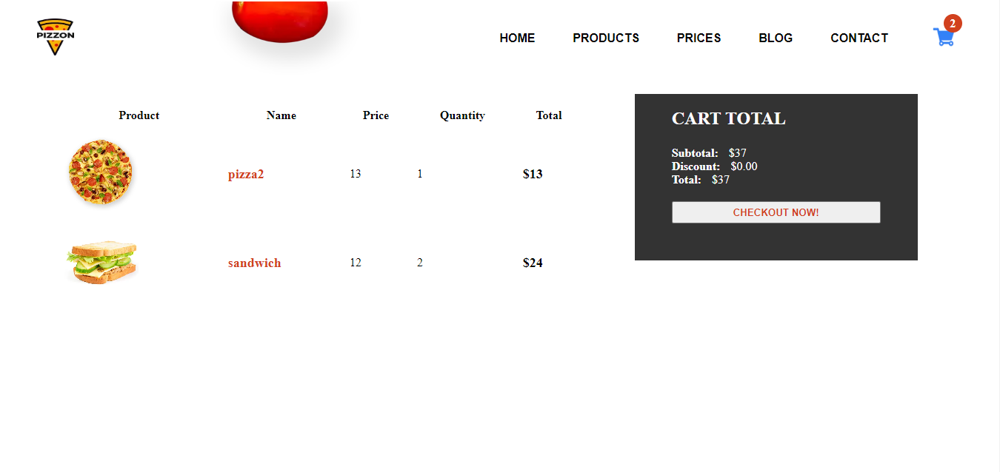

# Pizzon

This is a Fullstack [Next.js](https://nextjs.org/) project bootstrapped with [`create-next-app`](https://github.com/vercel/next.js/tree/canary/packages/create-next-app).

## Table of contents

- [Overview](#overview)
  - [The challenge](#the-challenge)
  - [Screenshot](#screenshot)
  - [Links](#links)
- [My process](#my-process)
  - [Built with](#built-with)
  - [What I learned](#what-i-learned)
  - [Useful resources](#useful-resources)

## Overview

### The challenge

Users should be able to:

- View all products
- View individual product detail
- Add to cart
- View optimal layout depending on the screen size

### Screenshot





### Links

- Solution URL: (https://github.com/faozziyyah/pizzon)
- Live Site URL: (https://pizzon-alpha.vercel.app/)

## My process
### Built with

- [Next](https://nextjs.org/) - React framework
- [MongoDB](https://www.mongodb.com/) - Database
- [Mongoose](https://mongoosejs.com/) - Elegant mongodb object modeling for node.js
- [React Responsive Carousel](https://react-responsive-carousel.js.org/)

### What I learned

- MongoDB database setup with Mongoose
- Consuming backend APIs in NextJs
- Creating a carousel in NextJs

```React.js
export const getServerSideProps = async (ctx) => {
  const myCookie = ctx.req?.cookies || "";

  if (myCookie.token !== process.env.TOKEN) {
    return {
      redirect: {
        destination: "/admin/login",
        permanent: false,
      },
    };
  }

  const productRes = await fetch(`${BASE_API_URL}/api/products`);
  const result = await productRes.json()
  const result1 = result.data

  const orderRes = await fetch(`${BASE_API_URL}/api/orders`);
  const orderresult = await orderRes.json()
  const result2 = orderresult.data

  return {
    props: {
      orders: result2,
      products: result1,
    },
  };
};
```

### Useful resources

First, run the development server:

```bash
npm run dev
# or
yarn dev
# or
pnpm dev
# or
bun dev
```

Open [http://localhost:3000](http://localhost:3000) with your browser to see the result.

You can start editing the page by modifying `pages/index.js`. The page auto-updates as you edit the file.

## Learn More

To learn more about Next.js, take a look at the following resources:

- [Next.js Documentation](https://nextjs.org/docs) - learn about Next.js features and API.
- [Learn Next.js](https://nextjs.org/learn) - an interactive Next.js tutorial.

You can check out [the Next.js GitHub repository](https://github.com/vercel/next.js/) - your feedback and contributions are welcome!

## Deploy on Vercel

The easiest way to deploy your Next.js app is to use the [Vercel Platform](https://vercel.com/new?utm_medium=default-template&filter=next.js&utm_source=create-next-app&utm_campaign=create-next-app-readme) from the creators of Next.js.

Check out our [Next.js deployment documentation](https://nextjs.org/docs/deployment) for more details.
